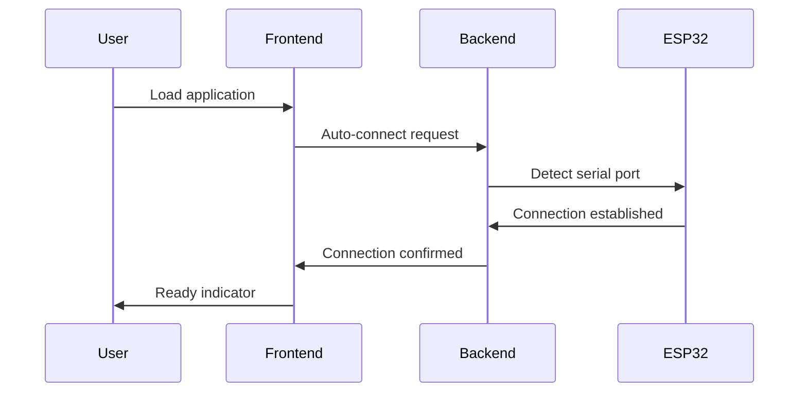
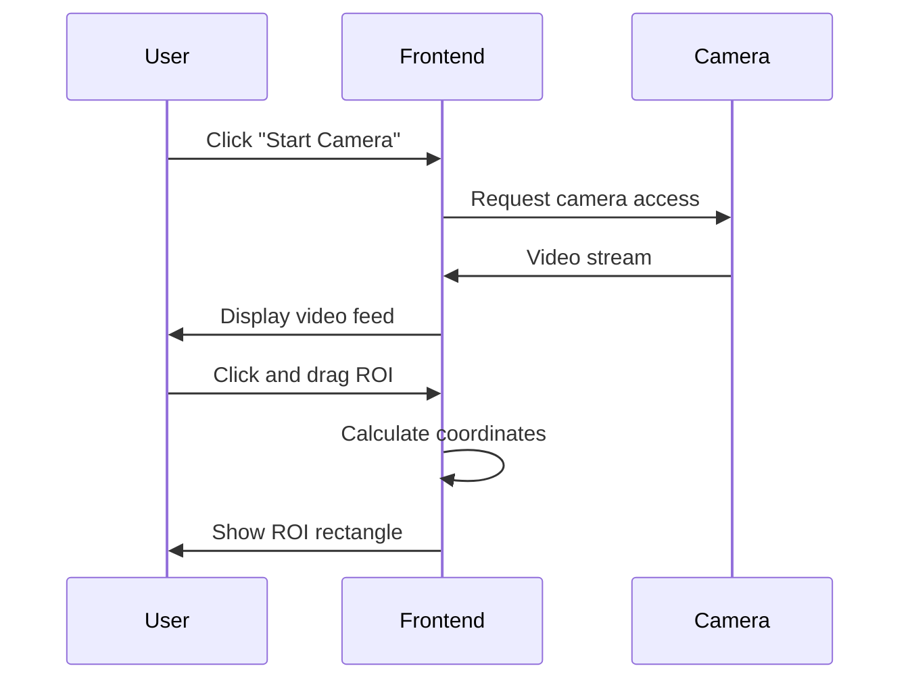
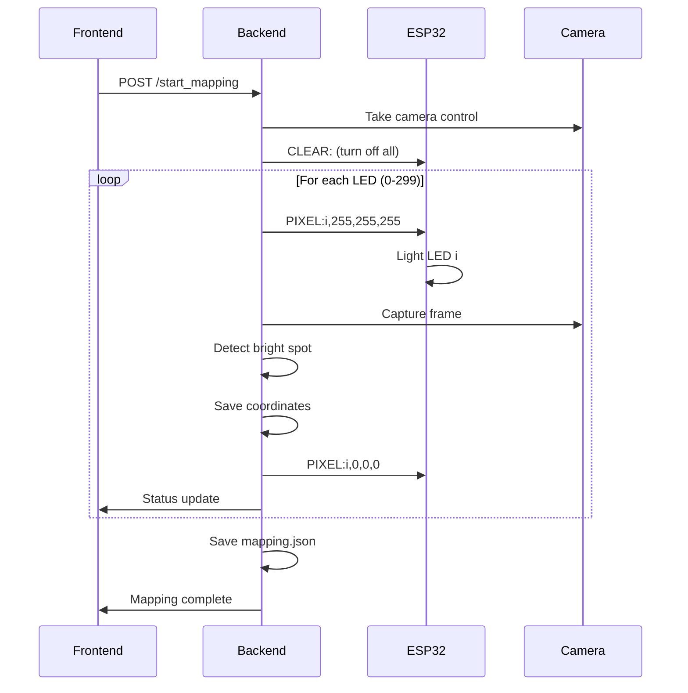

# Architecture Documentation

## System Overview

LED Wall Mapper V3 is a computer vision-based system for automatically mapping the physical positions of LEDs in a display wall. The system consists of three main components working together:

```
┌─────────────────────────────────────────────────────────────────┐
│                     LED Wall Mapper V3                         │
├─────────────────────────────────────────────────────────────────┤
│                                                                 │
│  ┌─────────────┐    ┌─────────────┐    ┌─────────────────────┐  │
│  │   Frontend  │    │   Backend   │    │       Hardware      │  │
│  │             │    │             │    │                     │  │
│  │  React App  │◄──►│ FastAPI +   │◄──►│  ESP32 + LEDs +    │  │
│  │  TypeScript │    │ OpenCV +    │    │  USB Serial +      │  │
│  │  Port 3001  │    │ Port 8000   │    │  Camera             │  │
│  └─────────────┘    └─────────────┘    └─────────────────────┘  │
│                                                                 │
└─────────────────────────────────────────────────────────────────┘
```

## Component Architecture

### Frontend (React TypeScript)

**Location:** `src/components/CameraPanel.tsx`

**Responsibilities:**
- Camera feed management using WebRTC
- Interactive ROI (Region of Interest) selection
- Real-time mapping progress display  
- Device connection management
- User interface and controls

**Key Features:**
- Auto-connects to ESP32 on startup
- Interactive click-and-drag ROI selection
- Real-time coordinate scaling between display and video resolution
- Progress tracking with live updates
- Error handling and user feedback

**State Management:**
```typescript
// Connection state
const [isConnected, setIsConnected] = useState(false);

// Camera state  
const [isVideoActive, setIsVideoActive] = useState(false);
const [isVideoReady, setIsVideoReady] = useState(false);

// ROI selection state
const [roi, setRoi] = useState<ROI | null>(null);
const [isDrawing, setIsDrawing] = useState(false);

// Mapping state
const [isMapping, setIsMapping] = useState(false);
const [mappingStatus, setMappingStatus] = useState<MappingStatus | null>(null);
```

### Backend (Python FastAPI)

**Location:** `backend/main.py`

**Responsibilities:**
- RESTful API server with CORS support
- Computer vision processing using OpenCV
- Serial communication with ESP32
- LED mapping coordination and threading
- Data persistence and export

**Core Modules:**

1. **Serial Manager** (`SerialManager` class)
   - ESP32 device detection and connection
   - Serial command protocol implementation
   - Connection state management and error recovery

2. **Computer Vision** (`_mapping_worker` function)
   - Camera capture and frame processing
   - LED detection using brightness analysis
   - Coordinate normalization and mapping

3. **API Endpoints**
   - Device control (`/device/connect`, `/device/power`)
   - Mapping control (`/start_mapping`, `/status`)
   - Health monitoring (`/`)

**Threading Model:**
```python
# Main FastAPI thread handles HTTP requests
# Background worker thread handles LED mapping
th = Thread(target=_mapping_worker, args=(req,), daemon=True)
th.start()
```

### Hardware Layer

**Components:**
- **ESP32/Arduino**: Microcontroller running custom firmware
- **WS2812B LED Strip**: Addressable RGB LEDs (up to 300)
- **USB Serial**: Communication bridge between computer and ESP32
- **Camera**: Computer webcam for LED position detection

**Serial Protocol:**
```
Computer → ESP32:
- CLEAR:              Turn off all LEDs
- PIXEL:idx,r,g,b     Set specific LED color
- ALL:r,g,b           Set all LEDs to color
- BRIGHT:value        Set global brightness
- BLINK:idx           Blink specific LED

ESP32 → Computer:
- OK:operation        Command successful
- ERROR:message       Command failed
```

## Data Flow

### 1. Initialization Sequence



### 2. ROI Selection Process



### 3. LED Mapping Process



## Key Algorithms

### ROI Coordinate Transformation

The system handles coordinate transformation between display coordinates and actual video resolution:

```typescript
// Mouse click → Video coordinates
const scaleX = video.videoWidth / rect.width;
const scaleY = video.videoHeight / rect.height;
const videoX = mouseX * scaleX;
const videoY = mouseY * scaleY;

// Video coordinates → Normalized (0-1)
const normalizedX = videoX / video.videoWidth;
const normalizedY = videoY / video.videoHeight;
```

### LED Detection Algorithm

Computer vision approach for finding lit LEDs:

```python
def _find_single_spot(gray_roi, tolerance):
    # Find maximum brightness in ROI
    _, maxVal, _, _ = cv2.minMaxLoc(gray_roi)
    
    # Create threshold mask
    thresh_val = max(0, maxVal - tolerance)
    _, mask = cv2.threshold(gray_roi, thresh_val, 255, cv2.THRESH_BINARY)
    
    # Check for single connected component
    num_labels, _ = cv2.connectedComponents(mask)
    if num_labels == 2:  # Background + 1 LED
        return True, centroid_of_mask(mask)
    
    return False, (0, 0)
```

### Brightness Adaptation

Dynamic brightness adjustment for optimal detection:

```python
current_brightness = base_brightness
attempts = 0

while attempts < 10 and not spot_found:
    send_led_command(i, current_brightness)
    spot_found = detect_led_in_frame()
    
    if not spot_found:
        # Reduce brightness to minimize interference
        current_brightness = max(MIN_BRIGHTNESS, current_brightness * 0.7)
        attempts += 1
```

## Performance Characteristics

### Timing Constraints

| Operation | Target Time | Actual Performance |
|-----------|-------------|-------------------|
| LED settle time | 150ms | Configurable via `SETTLE_MS` |
| Frame capture | <50ms | Depends on camera/OpenCV |
| Detection processing | <100ms | Optimized OpenCV operations |
| Total per LED | ~300ms | 300 LEDs = ~90 seconds |

### Memory Usage

| Component | Memory Usage | Notes |
|-----------|-------------|-------|
| Frontend | ~50MB | React + camera stream |
| Backend | ~100MB | OpenCV + video processing |
| Frame buffer | ~3MB | 1280x720 RGB frames |
| Coordinate storage | ~5KB | 300 LED positions |

### Scalability Limits

| Parameter | Current Limit | Theoretical Max |
|-----------|---------------|-----------------|
| LED count | 300 | 65,535 (uint16) |
| Camera resolution | 1280x720 | Hardware dependent |
| Frame rate | 30fps | Camera dependent |
| Detection accuracy | ±2 pixels | Algorithm dependent |

## Error Handling Strategy

### Frontend Error Recovery

1. **Camera Errors**: Graceful fallback with user guidance
2. **Connection Errors**: Auto-retry with exponential backoff
3. **Mapping Errors**: Progress preservation and restart capability
4. **UI Errors**: Error boundaries with user-friendly messages

### Backend Error Recovery

1. **Serial Errors**: Automatic reconnection attempts
2. **Camera Errors**: Resource cleanup and error reporting
3. **Processing Errors**: Thread safety and state consistency
4. **File I/O Errors**: Atomic operations and backup strategies

### Hardware Error Recovery

1. **ESP32 Disconnection**: Detection and reconnection
2. **LED Failures**: Brightness adaptation and retry logic
3. **Power Issues**: Graceful degradation and user notification
4. **Serial Corruption**: Protocol validation and recovery

## Security Considerations

### Attack Surface

1. **Network**: Local HTTP server (port 8000)
2. **USB Serial**: Direct hardware communication
3. **Camera**: Local device access only
4. **File System**: Local JSON file creation

### Mitigation Strategies

1. **CORS Policy**: Restricts cross-origin requests
2. **Input Validation**: Pydantic models for API validation
3. **Resource Limits**: Bounded operations and timeouts
4. **Error Sanitization**: No sensitive data in error messages

## Extension Points

### Adding New LED Types

1. Implement new serial commands in ESP32 firmware
2. Add command methods to `SerialManager` class
3. Update frontend controls as needed

### Supporting Multiple Cameras

1. Extend `CAM_INDEX` to array of camera indices
2. Modify OpenCV capture to handle multiple streams
3. Add camera selection UI

### Custom Detection Algorithms

1. Implement new detection function in `_mapping_worker`
2. Add algorithm selection parameter to API
3. Extend configuration options

### Real-time LED Control

1. Add WebSocket support for real-time communication
2. Implement streaming LED control protocol
3. Add performance optimization for high-frequency updates

## Development Guidelines

### Code Organization

```
src/
├── components/          # React components
│   ├── CameraPanel.tsx  # Main application logic
│   └── ui/              # Reusable UI components
├── types/               # TypeScript type definitions
└── utils/               # Utility functions

backend/
├── main.py              # FastAPI application
├── models/              # Pydantic data models  
├── services/            # Business logic
└── utils/               # Utility functions
```

### Testing Strategy

1. **Unit Tests**: Core algorithms and utilities
2. **Integration Tests**: API endpoints and serial communication
3. **E2E Tests**: Full user workflows with Playwright
4. **Hardware Tests**: LED control and detection accuracy

### Performance Monitoring

1. **Frontend**: React DevTools profiling
2. **Backend**: FastAPI metrics and logging
3. **Computer Vision**: OpenCV performance timers
4. **Serial Communication**: Throughput and latency metrics